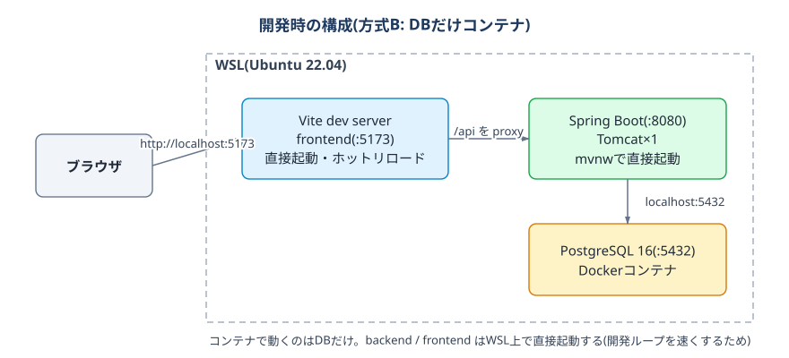

# training-task — タスク管理アプリ(お手本リポジトリ)

React + Spring Boot + PostgreSQL の完成品テンプレートです。
**このリポジトリの構成・作法を維持したまま**、Claude Code に指示して機能を追加していきます。開発ルールは [CLAUDE.md](./CLAUDE.md) を必ず読んでください。

初回の環境構築が未完了の場合は、先に training-docs の [ローカル開発環境セットアップ手順書](https://github.com/BFHcopilot/training-docs/blob/main/生成AI研修_ローカル開発環境セットアップ手順書.md) を実施してください。

## 研修の流れ

この順に進めます。詳細は各手順書へ。

1. [初回環境構築時にすること（タスク管理アプリの確認）](./docs/local-run.md) — training-docs のセットアップ手順書の続き
2. [ローカルで環境構築後にすること（本番リリースの準備）](./docs/prod-prepare.md)
3. [初回本番リリースですること（タスク管理アプリの確認）](./docs/prod-release.md)
4. [次にすること（タスク管理アプリの修正と都度リリース）](./docs/app-edit.md)
5. [本番サーバーの掃除（次の課題への準備）](./docs/server-clean.md)

研修は**課題ごとに別リポジトリ**で進めます。5まで終わったら、次の課題の始め方は [docs/repos-guide.md](./docs/repos-guide.md) を参照してください。

## 技術スタック

| 領域 | 技術 |
|---|---|
| frontend | React 18 / TypeScript 5 / Vite 5 |
| backend | Java 17 / Spring Boot 3.3 / Maven |
| DB | PostgreSQL 16 / Flyway |
| 本番 | Docker Compose / nginx / AWS Lightsail |
| デプロイ | ローカルでビルドしたイメージを scp でサーバーへ転送して起動(サーバーではビルドしない) |

## 開発時の構成(方式B: DBだけコンテナ)



backend/frontend を直接起動するのは開発ループ(ホットリロード・デバッガ)を速くするためです。
本番は `docker-compose.prod.yml` で全てコンテナになります(環境差は環境変数で吸収)。

## 品質チェック(コミット前に実行)

```bash
cd backend && ./mvnw verify                      # テスト + Checkstyle + ArchUnit
cd frontend && npm run lint && npm test && npm run build
```

## よく使う操作

| やりたいこと | コマンド |
|---|---|
| DBを初期状態に戻す | `docker compose down -v && docker compose up -d` |
| DBに直接入る | `docker compose exec db psql -U app appdb` |
| DBをGUI(A5:SQL Mk-2)で見る | 接続手順は [docs/docker-commands.md](./docs/docker-commands.md) の「GUIツール(A5:SQL Mk-2)でDBに入る」参照 |
| 本番構成をローカルで確認 | `docker compose -f docker-compose.prod.yml up --build` |

## リファレンス

| ドキュメント | 内容 |
|---|---|
| [CLAUDE.md](./CLAUDE.md) | AIへの開発ルール(技術スタック・アーキテクチャ・禁止事項) |
| [docs/design/](./docs/design/) | 設計書(システム単位)。[design/task/](./docs/design/task/) がお手本 |
| [docs/architecture-guide.md](./docs/architecture-guide.md) | アーキテクチャガイド(ドメインに依存しない「機能追加の型」) |
| [docs/software-architecture.md](./docs/software-architecture.md) | ソフトウェアアーキテクチャ解説(型の背景にある原則・クラス分割の基準・現場での選択肢) |
| [docs/repos-guide.md](./docs/repos-guide.md) | リポジトリ構成ガイド(1課題=1リポジトリ。課題リポの始め方) |
| [docs/server-rebuild.md](./docs/server-rebuild.md) | サーバーのリセット・作り直し手順(困ったら直さず作り直す) |
| [docs/git-commands.md](./docs/git-commands.md) / [docs/docker-commands.md](./docs/docker-commands.md) | Git・Dockerコマンド集 |
| [docs/troubleshooting.md](./docs/troubleshooting.md) | 環境トラブルのFAQ |
| [docs/architecture.drawio](./docs/architecture.drawio) | 構成図の詳細版(全体像・通信経路・本番構成の3ページ) |

## ディレクトリ構成

```
├── CLAUDE.md               # AIへの開発ルール(最重要)
├── docker-compose.yml      # 開発用(DBのみ)
├── docker-compose.prod.yml # 本番用(全てコンテナで起動)
├── backend/                # Spring Boot(レイヤードアーキテクチャ)
├── frontend/               # React + Vite
├── web/                    # 本番配信用(nginx設定 + frontendをビルドするDockerfile)
├── scripts/doctor.sh       # 環境診断
└── docs/                   # 研修の流れの各手順書 / デプロイ手順 / FAQ / 構成図
```
