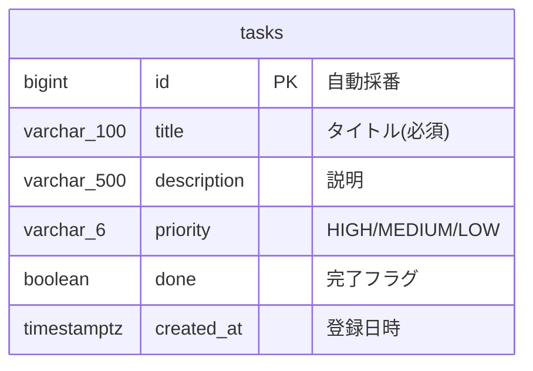

# 基本設計書 — タスク管理アプリ

| 項目           | 内容                                                                      |
| -------------- | ------------------------------------------------------------------------- |
| 文書の位置づけ | 要件を「どういう画面・API・データ構造で実現するか」に落とし込む(外部設計) |
| 上位文書       | [02\_要件定義.md](./02_要件定義.md)                                       |

## 1. システム構成

構成図は [../../images/architecture.png](../../images/architecture.png)(詳細版: [../../architecture.drawio](../../architecture.drawio))を参照。
SPA(React)+ REST API(Spring Boot)+ RDB(PostgreSQL)の3層構成。

## 2. 画面設計

### 画面一覧

| 画面ID | 画面名         | パス | 概要                                        | 対応機能 |
| ------ | -------------- | ---- | ------------------------------------------- | -------- |
| S-01   | タスク一覧画面 | /    | 一覧表示・登録・完了切替・削除を1画面で行う | F-1〜F-5 |

### S-01 画面項目・アクション

| 項目/操作        | 内容                                                                                                    | 呼び出すAPI |
| ---------------- | ------------------------------------------------------------------------------------------------------- | ----------- |
| ヘッダー         | タイトルと残件数(未完了の数)を表示                                                                      | —           |
| 登録フォーム     | タイトル(必須)・説明(任意)・優先度(高/中/低、初期値は中)・追加ボタン。タイトル空の間はボタン非活性      | A-03        |
| タスク一覧       | 登録順(ID昇順)または優先度順(高→中→低)で表示。各行に優先度を表示し、完了タスクは取り消し線+背景色で区別 | A-01        |
| 並び順           | 登録順と優先度順を切り替える                                                                            | A-01        |
| チェックボックス | 完了⇔未完了を切り替える                                                                                 | A-04        |
| 削除ボタン       | タスクを削除する                                                                                        | A-05        |
| エラー表示       | API失敗時、画面上部にメッセージを表示                                                                   | —           |

## 3. API設計

### API一覧

| API ID | メソッド | パス            | 概要                                             | 正常時 | 対応機能 |
| ------ | -------- | --------------- | ------------------------------------------------ | ------ | -------- |
| A-01   | GET      | /api/tasks      | タスク一覧取得。`sort=priority` 指定時は優先度順 | 200    | F-1, F-5 |
| A-02   | GET      | /api/tasks/{id} | タスク1件取得                                    | 200    | —        |
| A-03   | POST     | /api/tasks      | タスク登録(優先度省略時は中)                     | 201    | F-2, F-5 |
| A-04   | PUT      | /api/tasks/{id} | タスク更新(完了切替を含む)                       | 200    | F-3      |
| A-05   | DELETE   | /api/tasks/{id} | タスク削除                                       | 204    | F-4      |

### 入出力(共通)

- リクエスト(A-03): `{ "title": string, "description": string|null, "priority": "HIGH"|"MEDIUM"|"LOW" }` (`priority`省略時は`MEDIUM`)
- リクエスト(A-04): `{ "title": string, "description": string|null, "done": boolean }`
- レスポンス: `{ "id": number, "title": string, "description": string|null, "priority": "HIGH"|"MEDIUM"|"LOW", "done": boolean, "createdAt": string }`
- A-01の`sort`は省略時にID昇順、`priority`指定時にHIGH→MEDIUM→LOW。同一優先度内はID昇順
- エラー: `{ "message": string }` に統一。バリデーション違反=400、対象なし=404

各項目の型・必須・文字数などの詳細は Swagger UI(/api/docs)を正とする。

## 4. データ設計

### ER図

カラムの詳細定義は [04\_詳細設計.md](./04_詳細設計.md) のテーブル定義書を参照。

## 5. 処理方式

- 完了切替・削除は楽観的な単純更新とし、同時編集の排他制御は行わない(同時利用10名規模のため。要件2.性能)
- 一覧はページングなしの全件取得とする(タスク件数は数百件規模を想定)

## 6. 要件トレーサビリティ

| 要件           | 画面 | API        |
| -------------- | ---- | ---------- |
| F-1 一覧表示   | S-01 | A-01       |
| F-2 登録       | S-01 | A-03       |
| F-3 完了切替   | S-01 | A-04       |
| F-4 削除       | S-01 | A-05       |
| F-5 優先度管理 | S-01 | A-01, A-03 |
