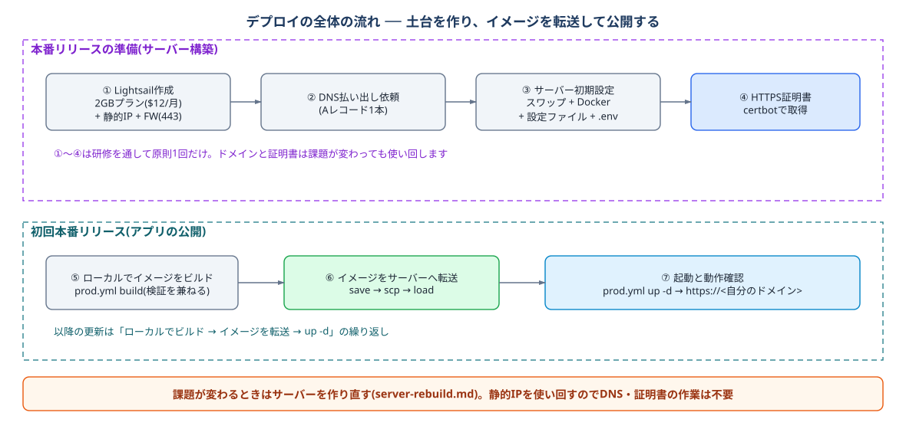
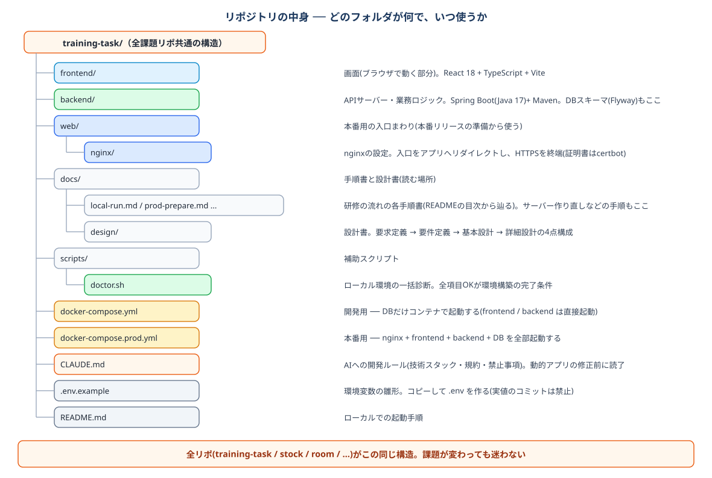

# ローカルで環境構築後にすること（本番リリースの準備）



*デプロイの全体の流れ ── ①〜④の土台作りは研修を通して原則1回だけ*

デプロイの前に、リポジトリのどのフォルダが何なのかを押さえておきます。



デプロイの観点では **docker-compose の3ファイルの使い分け**がすべてです。

| ファイル | 起動するもの | 使う場面 |
| --- | --- | --- |
| `docker-compose.yml` | DBだけ | ローカル開発(frontend / backend は直接起動) |
| `docker-compose.prod.yml` | nginx + frontend + backend + DB | 本番 |

## 1. Lightsail インスタンスの作成

1. AWSコンソール → Lightsail → **インスタンスの作成**
2. リージョン: **東京 (ap-northeast-1)**
3. プラットフォーム: **Linux/Unix**、設計図: **OS のみ → Ubuntu 22.04 LTS**
4. プラン: **2GBメモリのプラン(月額 $12・固定)**。512MB/1GBプランはメモリ不足で研修に不向き
5. インスタンス名: 講師の指定に従う(例: `training-yamada`)
6. 作成後、**ネットワーキング**タブ → **静的IPの作成** → インスタンスにアタッチ
7. 同タブのファイアウォールで **HTTPS (443)** を追加(HTTP 80 と SSH 22 は最初から開いています)

## 2. DNS の設定(講師に払い出しを依頼。研修を通して1回だけ)

DNSゾーンは**講師が管理**しています。手順1で取得した**静的IP**を講師に連絡し、以下の**Aレコード1本**の登録を依頼してください(自分でDNS管理画面を操作する必要はありません)。

| 種別 | 名前 | 値 | 用途 |
|---|---|---|---|
| A | (自分のドメイン)　例: `yamada.example.com` | 静的IP | アプリ用(そのとき公開中のシステムが表示される) |

ドメインは `yamada.example.com` のような形で1人1本割り当てられ、**全システム共通で研修の最後まで変わりません**。以降どのシステムを公開するときもDNSの依頼は不要です(静的IPを使い回すため、サーバーを作り直しても変わりません)。

登録されたら反映を確認します(数分かかることがあります)。

🟧 **Ubuntu（ローカル）**

```bash
$ dig +short <自分のドメイン>   # 静的IPが返ればOK
```

## 3. サーバーの初期設定

WSL(ローカルのUbuntu)からSSH接続します(以降サーバー上で実行)。初回のみ以下の鍵の準備が必要です(この鍵は手順3-3の設定ファイル転送や、[prod-release.md](./prod-release.md) のイメージ転送(scp)でも使います)。

### 3-0. SSH鍵の準備(初回だけ)

1. Lightsailコンソール右上のアカウントメニュー → **アカウント** → **SSHキー**タブ
2. **東京 (ap-northeast-1)** のデフォルトキーを**ダウンロード**(`LightsailDefaultKey-ap-northeast-1.pem` がWindowsのダウンロードフォルダに保存される)
3. WSLの `~/.ssh` に移動し、権限を絞る(権限が緩いとSSHが鍵の使用を拒否します)

🟧 **Ubuntu（ローカル）**

```bash
$ mkdir -p ~/.ssh
$ cp /mnt/c/Users/<Windowsユーザー名>/Downloads/LightsailDefaultKey-ap-northeast-1.pem ~/.ssh/
$ chmod 600 ~/.ssh/LightsailDefaultKey-ap-northeast-1.pem
```

準備ができたら接続します。

🟧 **Ubuntu（ローカル）**

```bash
$ ssh -i ~/.ssh/LightsailDefaultKey-ap-northeast-1.pem ubuntu@<静的IP>
```

> 初回接続時は `Are you sure you want to continue connecting?` と聞かれるので `yes` と入力します。`ubuntu@ip-...:~$` のプロンプトが表示されれば接続成功です。

### 3-1. スワップの作成(必須)

本番はJava(backend)とDBが同居し、2GBプランではメモリに大きな余裕がありません。保険としてスワップを作っておきます(メモリ不足でコンテナが落ちる事故を防げます)。

🟩 **サーバー（Lightsail）**

```bash
$ sudo fallocate -l 2G /swapfile
$ sudo chmod 600 /swapfile
$ sudo mkswap /swapfile
$ sudo swapon /swapfile
$ echo '/swapfile none swap sw 0 0' | sudo tee -a /etc/fstab
$ free -h   # Swap に 2.0Gi が表示されればOK
```

### 3-2. Docker Engine のインストール

ローカル構築(セットアップ手順書の4.2)と同じ手順を、今度はサーバー上で実行します。

🟩 **サーバー（Lightsail）**（1行ずつ実行）

```bash
$ sudo install -m 0755 -d /etc/apt/keyrings
$ sudo curl -fsSL https://download.docker.com/linux/ubuntu/gpg -o /etc/apt/keyrings/docker.asc
$ echo "deb [arch=$(dpkg --print-architecture) signed-by=/etc/apt/keyrings/docker.asc] https://download.docker.com/linux/ubuntu $(. /etc/os-release && echo $VERSION_CODENAME) stable" | sudo tee /etc/apt/sources.list.d/docker.list > /dev/null
$ sudo apt update
$ sudo apt install -y docker-ce docker-ce-cli containerd.io docker-buildx-plugin docker-compose-plugin
$ sudo usermod -aG docker ubuntu
$ exit   # 反映のため一度切断して再接続する
```

### 3-3. 構成ファイルと本番用 .env の配置

サーバーに置くのは **compose設定ファイルと `.env` だけ**です。ソースコードはサーバーに置きません(アプリは、ローカルでビルドして転送したイメージで動きます)。ローカルのリポジトリから scp で転送します。

🟧 **Ubuntu（ローカル）**

```bash
$ cd ~/projects/<リポジトリ名>
$ scp -i ~/.ssh/LightsailDefaultKey-ap-northeast-1.pem \
    docker-compose.prod.yml .env.example ubuntu@<静的IP>:~/
```

サーバーに戻り、`.env` を作成します。

🟩 **サーバー（Lightsail）**

```bash
$ cp .env.example .env
$ nano .env
```

> nanoの操作: 編集したら **Ctrl+O → Enter** で保存(画面下部にファイル名が出たらEnterで確定)、**Ctrl+X** で終了します。保存せずに閉じようとすると `Save modified buffer?` と聞かれるので、保存するなら `Y` → Enter、破棄するなら `N` です。

`.env` では次の2つを設定します。

- `DOMAIN`: 割り当てられた**自分のドメイン**。アプリは `https://<自分のドメイン>` で公開されます
- `DB_PASSWORD`: この機会に本番用の強い値へ変えておきます(アプリ公開時([prod-release.md](./prod-release.md))に使用)

設定後の `.env` の例(ドメインが `yamada.example.com` の場合):

```ini
DB_NAME=appdb
DB_USER=app
DB_PASSWORD=kZ8vW3pTq6Ln

DOMAIN=yamada.example.com
```

`DB_NAME` と `DB_USER` は初期値のままでかまいません。

編集を終えたら、保存できていることを必ず確認します(SSHが途中で切断されると、nanoの編集内容が保存されていないことがあります)。

🟩 **サーバー（Lightsail）**

```bash
$ cat .env   # DOMAIN が自分のドメインになっていればOK
```

## 4. HTTPS証明書の取得

DNSの反映(手順2)を確認してから実行します。

🟩 **サーバー（Lightsail）**

```bash
$ sudo apt install -y certbot
$ sudo certbot certonly --standalone \
    -d <自分のドメイン> \
    --agree-tos -m <メールアドレス> --non-interactive
```

`Successfully received certificate` と表示されればOK。証明書は `/etc/letsencrypt/live/<自分のドメイン>/` に作られます。ドメイン構成は最後まで変わらないため、`--expand` などの証明書変更は以降不要です(サーバーを作り直したときに同じコマンドで再取得するだけ。[server-rebuild.md](./server-rebuild.md) 参照)。

> 有効期間は90日。研修期間内なら初回取得のみで足ります。更新が必要な場合は、稼働中のcomposeを一度 `stop` → `sudo certbot renew` → `start` の順で実行します。

**完了条件**: サーバーにHTTPSの土台(静的IP・DNS・Docker・構成ファイル・証明書)ができている

次は [初回本番リリースですること（タスク管理アプリの確認）](./prod-release.md) へ。
