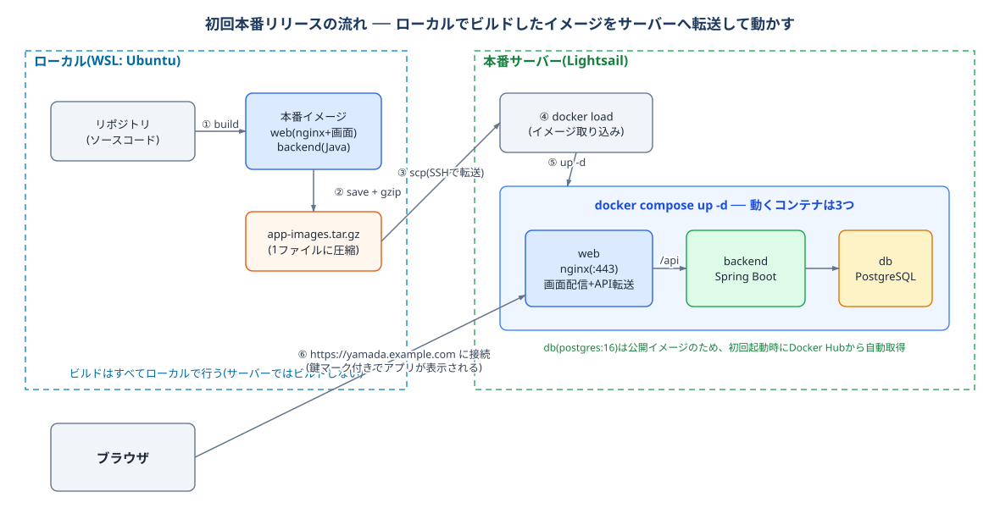

# 初回本番リリースですること（タスク管理アプリの確認）

[prod-prepare.md](./prod-prepare.md) で準備したサーバーに、タスク管理アプリを**そのまま**公開します(コードは変更しません)。



## 1. アプリのイメージをローカルでビルドする

本番用のイメージ(web / backend)をローカルでビルドします。ビルドが最後まで通ること自体が事前検証になります。

🟧 **Ubuntu（ローカル）**

```bash
$ cd ~/projects/<リポジトリ名>
$ docker compose -f docker-compose.prod.yml build
```

> 動作まで確認したい場合は `docker compose -f docker-compose.prod.yml up` を実行します。ローカルには証明書がないため web(nginx)は起動に失敗しますが、**backend と db が正常起動すれば十分**です。確認後は `Ctrl+C` → `docker compose -f docker-compose.prod.yml down` で片付けます。

## 2. イメージをサーバーへ転送する

ビルドしたイメージをファイルにしてサーバーへ転送します(圧縮後で百数十MB程度。回線によっては数分かかります)。

🟧 **Ubuntu（ローカル）**

```bash
$ docker save my-training-task-web:latest my-training-task-backend:latest | gzip > app-images.tar.gz
$ scp -i ~/.ssh/LightsailDefaultKey-ap-northeast-1.pem app-images.tar.gz ubuntu@<静的IP>:~/
```

## 3. サーバーで起動する

サーバーでイメージを取り込んで起動します(DBのイメージ `postgres:16` だけは公開イメージなので、初回起動時にサーバーが自動で取得します)。

🟩 **サーバー（Lightsail）**

```bash
$ docker load -i app-images.tar.gz && rm app-images.tar.gz
$ docker compose -f docker-compose.prod.yml up -d
$ docker compose -f docker-compose.prod.yml ps     # web / backend / db が Up であること
$ docker compose -f docker-compose.prod.yml logs -f backend   # 起動ログの確認(Ctrl+Cで抜ける)
```

> ビルドは手元で行い、サーバーは出来上がったイメージを受け取って動かすだけ——この**「ビルドとデプロイの分離」**が実務の基本形です(サーバーにビルド負荷をかけず、ソースコードもサーバーに置きません)。

## 4. 動作確認

ブラウザで **`https://<自分のドメイン>`**(例: `https://yamada.example.com`)を開き、**タスク管理アプリ**(初期タスク3件が表示され、追加・完了・削除ができる)が鍵マーク付きで表示されれば**初リリース完了**です🎉(コードを1行も変えずに本番まで通せたことに意味があります)

本番に表示されるのは**いま公開している課題リポのアプリだけ**です。次の課題(在庫管理など)に移るときは、サーバーを作り直してから新しい課題リポで同じ流れを繰り返します([server-rebuild.md](./server-rebuild.md) / [repos-guide.md](./repos-guide.md))。

> 何が起きているか: nginxが入口です。アプリの画面はReactのビルド成果物をそのまま配信し、`/api` へのリクエストだけbackendコンテナへ転送しています。設定は `web/nginx/default.conf.template` にあります。

### アプリが表示されないときのチェックリスト

「このサイトにアクセスできません」になる場合は、上から順に確認します。

1. **ファイアウォールの HTTPS (443)** — [prod-prepare.md](./prod-prepare.md) 手順1の7の追加漏れが最多です。Lightsailの**ネットワーキング**タブに `HTTPS TCP 443` のルールがあるか確認。**証明書取得が成功していても443は別**で、閉じているとブラウザからのHTTPSだけが失敗します
2. **`.env` の `DOMAIN`** — `cat .env` で自分のドメインになっているか確認。初期値のままだとnginxが証明書を読めず起動できません。修正したら `docker compose -f docker-compose.prod.yml up -d --force-recreate` で作り直します
3. **コンテナの状態** — `docker compose -f docker-compose.prod.yml ps` で `Up` が続いているか(`Restarting` を繰り返すのは2の症状)。`docker compose -f docker-compose.prod.yml logs web` に `cannot load certificate` があれば証明書パスの問題です
4. **DNS** — `dig +short <自分のドメイン>` が静的IPを返すか([prod-prepare.md](./prod-prepare.md) 手順2の反映待ちの可能性)

**完了条件**: アプリが自分のドメインでHTTPS公開されている(無変更で通した)

> 学び: 無変更のまま先に本番まで一周して環境の問題を潰しておくと、以降のエラーは「自分の変更が原因」と即断できます。

次は [次にすること（タスク管理アプリの修正と都度リリース）](./app-edit.md) へ。

---

## 補足: 更新デプロイ(2回目以降)

コードを変更してmainにマージしたら、ローカルで最新のmainからイメージをビルドし直して転送します。

🟧 **Ubuntu（ローカル）**

```bash
$ git switch main && git pull
$ docker compose -f docker-compose.prod.yml build
$ docker save my-training-task-web:latest my-training-task-backend:latest | gzip > app-images.tar.gz
$ scp -i ~/.ssh/LightsailDefaultKey-ap-northeast-1.pem app-images.tar.gz ubuntu@<静的IP>:~/
```

🟩 **サーバー（Lightsail）**

```bash
$ docker load -i app-images.tar.gz && rm app-images.tar.gz
$ docker compose -f docker-compose.prod.yml up -d
```

## 補足: 運用でよく使うコマンド

| やりたいこと | コマンド(サーバーで実行) |
|---|---|
| 全ログを見る | `docker compose -f docker-compose.prod.yml logs -f` |
| 再起動 | `docker compose -f docker-compose.prod.yml restart` |
| 停止(データは残る) | `docker compose -f docker-compose.prod.yml down` |
| DBごと初期化 | `docker compose -f docker-compose.prod.yml down -v` の後、up |
| ディスク使用量の掃除 | `docker system prune -f`(古いイメージの削除) |

証明書の更新が必要になった場合(90日超え): `docker compose -f docker-compose.prod.yml stop web` → `sudo certbot renew` → `start web`

## 補足: 研修終了後の片付け(重要: 課金が続きます)

- [ ] Lightsail インスタンスを**削除**する(アプリごと消えます)
- [ ] **静的IPを解放**する(インスタンスにアタッチされていない静的IPは課金対象です)
