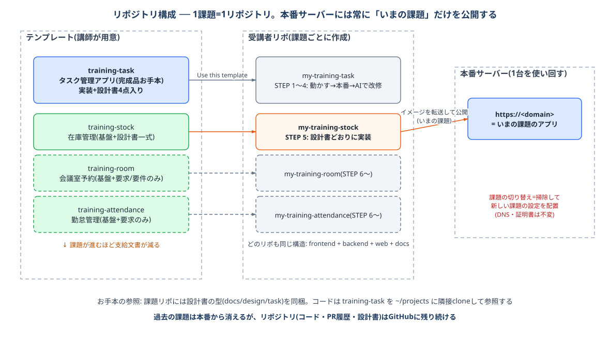

# リポジトリ構成ガイド — 1課題 = 1リポジトリ

この研修は**課題(システム)ごとに独立したリポジトリ**で進めます。本書はその全体構成と、課題リポの始め方・お手本の参照方法を説明します。

---

## 1. 全体構成



```
GitHub Organization
├── training-task          # タスク管理アプリ(完成品お手本)  ← STEP1-2 の起点
├── training-stock         # 在庫管理(基盤+課題文書のみ)    ← STEP3 の起点
├── training-room          # 会議室予約(基盤+課題文書のみ)  ← STEP4 の起点
├── training-attendance    # 勤怠管理(基盤+要求のみ)        ← STEP5 の起点
│
└── 受講者リポ(各テンプレートから「Use this template」で作成)
      training-<名前>-task / -stock / -room / -attendance
```

- **training-task** だけが完成品(タスク管理の実装+設計書4点入り)。研修の前半はこれを動かし・本番公開し・改修します
- **training-stock 以降**は「基盤(インフラ・規約・docs)+課題文書」のみが入った状態から始まり、**実装は受講者がAIと作ります**。課題が進むほど支給文書が減ります(stock: 設計書一式 → room: 要求+要件 → attendance: 要求のみ)
- どのリポも構造は同一です: `frontend/ + backend/ + web/ + docs/`。**リポジトリの形そのものが「型」**であり、課題が変わっても迷う場所がありません

### 予備課題(早く終わった人・追加バッチ向け)

主要課題と同じ形式の課題リポを予備として用意しています(いずれも要求+要件を支給)。

| リポ | システム | 題材の業務ルール |
|---|---|---|
| training-library | 備品貸出管理 | 貸出中の備品は貸し出せない・返却期限切れの検出 |
| training-helpdesk | 問い合わせ管理 | 状態遷移(未対応→対応中→完了)と対応履歴 |
| training-expense | 経費申請 | 承認済み申請の変更禁止・月別/費目別集計 |
| training-visitor | 来客受付管理 | 予定と実績(チェックイン/アウト)・在館中の把握 |

### フェーズ2教材(既存システムの改修)

ゼロから作るフェーズ1と別に、**稼働中の既存システムを改修する**フェーズ2用のリポジトリがあります。
いずれも**約35モジュール・200クラス規模**で、「全部は読めない規模のシステムで影響調査する」訓練を行います。

| リポ | システム | 課題 |
|---|---|---|
| training-securities | 証券口座管理システム(実装入り) | NISA成長投資枠の拡大対応(影響調査→設計→修正→テスト) |
| training-retail | 販売管理システム(実装入り) | 消費税率の変更対応 10%・8%→0%(影響範囲の広い変更を既存を壊さずに) |
| training-logistics | 出荷・運賃管理システム(実装入り) | 燃油サーチャージ率の改定 8%→12%(切り上げ丸め・運賃マスタ不変が罠) |
| training-energy | 電気料金計算システム(実装入り) | 再エネ賦課金単価の改定 3.49円→1.40円/kWh(円/銭の単位変換が罠) |

## 2. なぜ課題ごとにリポジトリを分けるのか

| 理由 | 説明 |
|---|---|
| クリーンスタート | 全受講者が毎課題「既知の同一状態」から始める。前の課題での改造・失敗を持ち越さない(サーバーを掃除してまっさらに戻す運用と同じ思想) |
| 1リポ=1アプリのシンプルさ | リポの中身が常に「1つのアプリ」。構成の説明も、AIに渡すコンテキストも最小 |
| 採点・比較のしやすさ | 課題単位でリポが揃うので、講師は全員の同一課題を横並びでレビューできる |
| 本番との1対1対応 | 「いま公開しているもの=いまのリポ」。切り替え設定が不要 |

## 3. 本番との関係 — サーバーとドメインは使い回す

リポジトリは課題ごとに変わりますが、**サーバー(Lightsail)・静的IP・ドメイン・証明書の構成は全課題で共通**です。

```
課題の切り替え = ① サーバーを掃除する(server-clean.md。調子が悪いときは作り直し=server-rebuild.md)
                ② 新しい課題リポの構成ファイルを scp で配置して .env を作成
                ③ イメージをビルドして転送・起動(手順は各課題リポの実装手順書のリリース手順)
```

- `https://<自分のドメイン>` には**そのとき公開中の課題のアプリ**が表示されます
- DNS・証明書まわりの作業は課題が変わっても増えません(ドメイン構成が固定のため)
- 前の課題は本番から消えますが、リポジトリ(コード・PR履歴・設計書)はGitHubに残り続けます

## 4. 課題リポの始め方(STEP3以降)

1. その課題のテンプレート(例: `training-stock`)をブラウザで開き、**Use this template → Create a new repository**(リポ名は**全員共通**で `my-training-<課題名>`。例: `my-training-stock`)
2. `~/projects` 配下に clone する(/mnt/c 配下は禁止)
3. `bash scripts/doctor.sh` で環境を確認し、README の起動手順でプレースホルダ画面が出ることを確認する
4. `docs/assignment/` の課題文書を読み、設計 → 実装をAIと進める(進め方は各課題リポの手順書に従う)

## 5. お手本(タスク管理)の参照方法

課題リポにはタスク管理の**実装コードは入っていません**が、以下の形でお手本を参照できます。

- **設計書のお手本は課題リポに同梱**: `docs/design/task/`(要求定義〜詳細設計の4点)は全リポに入っています。自分の課題の設計書はこれと同じ構成・粒度で書きます
- **コードのお手本は、最初の課題で作った自分の `my-training-task`**: `~/projects` に clone 済みのものをそのまま使います(新たに clone する必要はありません)
- Claude Code は作業リポ(自分の課題リポ)で起動した上で、お手本をパスで参照させます。指示例:

> `~/projects/my-training-task` がお手本リポジトリです。その TaskController / TaskService / TaskApiTest / App.test.tsx の構成・作法を模倣して、在庫管理の品目マスタ機能を実装してください。CLAUDE.md のルールに従うこと。

※ Claude Code が作業ディレクトリ外を読む際は追加ディレクトリの許可を求められるので許可してください。

## 6. よくある質問

**Q. 前の課題の自分のコードを流用したい**
A. 前の課題リポはGitHubに残っているので参照は自由です。ただし丸ごとコピーではなく「お手本と同じ型で作り直す」ことが練習になります(型は毎回同じなので、2回目からは速くなります)。

**Q. 全課題を1つのリポにまとめた方が管理が楽では?**
A. この研修では分けます(§2)。1リポに複数システムを積むと、公開切り替えの仕組み・ポート割り当て・リソース名の衝突回避など「研修の本質でない複雑さ」が増えるためです。

**Q. 課題リポのバックエンドには何が入っている?**
A. 共通基盤のみです(例外ハンドラ等の `common/`、アプリ起動クラス、ArchUnit・Checkstyle・CI設定)。機能パッケージ(エンティティ・Controller等)とFlywayマイグレーションは受講者が最初から作ります(`V1__` は初期化用に予約済みのため `V2__` から)。

## 講師向けメモ

- 課題テンプレートを追加するときは、`training-stock` を複製して課題文書(`docs/assignment/`)を差し替え、README のシステム名を変更してください
- 共通基盤(CLAUDE.md・web/・CI・docs)を修正した場合は、**全テンプレートリポに同じ変更を反映**する必要があります(研修開始前に凍結するのが安全)
- 受講者リポの命名は `training-<名前>-<課題>` で統一すると、Organization内で課題ごとの一覧・比較がしやすくなります
