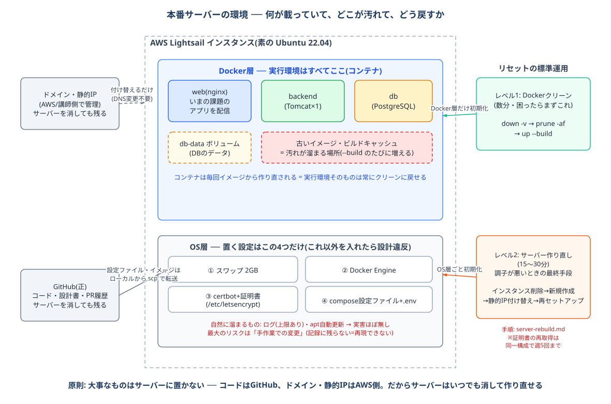

# サーバーのリセット・作り直し手順

**この研修のサーバー運用の原則: 「おかしくなったら直さない。作り直す」**

大事なものはサーバーに置いていません(コード・設計書はGitHub、ドメイン・静的IPはAWS側)。
だからサーバーはいつでも消して、既知のクリーンな状態に戻せます。環境起因のバグを2時間調べるより、30分で作り直して「それでも起きるか」を見る方が速く確実です。

サーバーの中身と汚れる場所の全体像は下図を参照してください。



## いつ実施するか

| タイミング | 実施内容 |
|---|---|
| デプロイや動作が何かおかしいとき | まず**レベル1**(数分)。直らなければレベル2 |
| 新しい課題への切り替え時 | 通常は**サーバーの掃除**([server-clean.md](./server-clean.md))で足ります。サーバーの状態に不安があるときはレベル2で作り直す |
| OSに手作業で何か入れてしまった/覚えていない変更があるとき | レベル2 |

## レベル1: Dockerクリーン(数分)

コンテナ・DBデータ・イメージ・ビルドキャッシュをすべて消して、Gitのコードからゼロから再構築します。OS(Ubuntu)には触りません。

🟩 **サーバー（Lightsail）**

```bash
$ docker compose -f docker-compose.prod.yml down -v   # コンテナ+DBボリュームを削除
$ docker system prune -af                             # 全イメージ・ビルドキャッシュを削除
```

イメージも消えるので、ローカルから送り直して起動します([prod-release.md](./prod-release.md) の手順3と同じ転送)。

```bash
$ docker load -i app-images.tar.gz && rm app-images.tar.gz
$ docker compose -f docker-compose.prod.yml up -d
```

> これで消えるもの: DBの全データ(Flywayが再適用するので初期データに戻る)、古いイメージ層。
> これで消えないもの: OSへの手作業変更、証明書、compose設定ファイルと.env。

## レベル2: サーバーの作り直し(15〜30分)

インスタンスごと破棄して、素のUbuntuから構築し直します。**静的IPを使い回すのでDNSは一切変更不要**です(講師への依頼も発生しません)。

### 手順

```
① 新しいインスタンスを作成        … prod-prepare.md 手順1と同じ(Ubuntu 22.04・2GB・ファイアウォールで443追加)
② 静的IPを付け替える              … Lightsail「ネットワーキング」→ 静的IPを旧インスタンスからデタッチ → 新インスタンスにアタッチ
③ 旧インスタンスを削除            … これ以降、旧サーバーの状態は完全に消える
④ サーバー初期設定                … prod-prepare.md 手順3(スワップ → Docker Engine → 構成ファイル配置 → .env)
⑤ 証明書を再取得                  … prod-prepare.md 手順4と同じコマンド
⑥ 公開                            … ローカルからイメージを転送(prod-release.md 手順3)→ docker load → up -d
```

- ①→②の順で行うと、ダウンタイムはIP付け替えの数分だけで済みます
- ④は [prod-prepare.md](./prod-prepare.md) で一度やった作業の反復です。**2回目は30分、3回目は15分で終わるようになります**——この「素のOSから再現できる」感覚を身につけることがこの手順の学習目的です
- `.env` はサーバーに置いていた実値が消えるので作り直します(`DB_PASSWORD` を控えていなかった場合は新しい値でOK。DBごと新しくなるため)

### 注意: 証明書のレート制限

Let's Encrypt は**同一ドメイン構成の証明書発行を週5回まで**に制限しています。週に何度も作り直すとひっかかるので、
「とりあえず作り直す」の前に必ずレベル1を試してください。制限に達した場合は解除まで最大1週間待ちになります(講師に相談)。

## なぜこの運用ができるのか(設計の意図)

| サーバーに置いてあるもの | 消えたら困るか |
|---|---|
| compose設定ファイルと.env | 困らない(scpで配置し直すだけ。正はGitHub) |
| Dockerイメージ・コンテナ | 困らない(Gitのコードから再ビルドできる) |
| DBのデータ | 困らない(研修のデータはFlywayの初期データで再現される) |
| 証明書 | 困らない(certbotで再取得できる。上記レート制限のみ注意) |
| OSの設定 | **4つしかない**(スワップ/Docker/certbot/構成ファイル+.env)。すべて prod-prepare.md に書いてある |

「サーバーを直せる人」より「サーバーをいつでも作り直せる人」の方が現場で信頼されます。
逆に、**手順書にない変更をサーバーに直接施すと、この表が崩れて作り直せないサーバー(=現場でよくある触れないサーバー)になっていきます。**

## 発展課題(早く終わった人向け)

- 手順④(prod-prepare.md 手順3)をシェルスクリプト `scripts/server-setup.sh` に自動化してみる(3回手でやった作業を自動化する、は現場の王道です)
- さらに進めるなら: Lightsailインスタンス作成そのものを AWS CLI で行う
